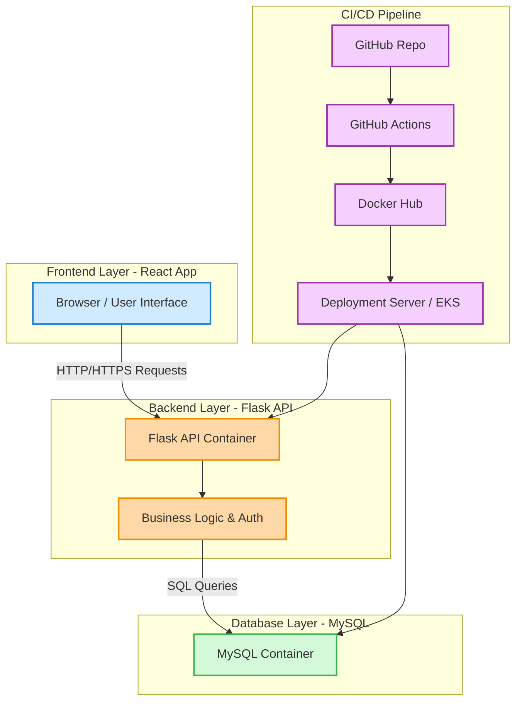

# Fullstack DevOps App

A full-stack application demonstrating **DevOps practices**, including containerization, CI/CD, and deployment-ready architecture.  
The project uses **React** for the frontend, **Flask** for the backend, and **MySQL** as the database.

---

## 🛠️ Features

- **Frontend:** React (Vite) served via Nginx
- **Backend:** Flask API with REST endpoints
- **Database:** MySQL 8 with initialization script
- **DevOps Tools:** Docker, Docker Compose, GitHub Actions CI/CD
- **Deployment:** Fully automated deployment pipeline
- **Microservices Architecture:** Frontend, backend, and database are separate services

---

## 📁 Project Structure

```
fullstack-devops-app/
├─ frontend/          # React application
├─ backend/           # Flask API
├─ db/                # MySQL init scripts
├─ docker-compose.yml # Docker Compose configuration
└─ .github/workflows/ # CI/CD pipeline definitions
```

---

## ⚙️ Prerequisites

- Docker & Docker Compose installed
- Git
- Node.js & npm (for frontend development if needed)
- Docker Hub account (for CI/CD image pushes)

---

## 🚀 Setup & Run Locally

1. Clone the repository:

```bash
git clone https://github.com/Misbah-Ashiq/fullstack-devops-app.git
cd fullstack-devops-app
```

2. Build and start the services:

```bash
docker compose up -d --build
```

3. Access the application:

- **Frontend:** [http://localhost:5173](http://localhost:3000)  
- **Backend API:** [http://localhost:5000](http://localhost:5000)

---

## 🔧 Usage

- **Frontend:** Use React components for user interactions (signup, signin, etc.)
- **Backend:** Provides REST endpoints for authentication and data handling
- **Database:** Stores user data and application state

---

## 📦 Docker Services

- **frontend:** React app served via Nginx
- **backend:** Flask API
- **db:** MySQL database initialized with `init.sql`

---

## 📈 CI/CD Pipeline

This project features a fully automated **CI/CD pipeline** using **GitHub Actions**:

- **Automatic Build & Push to Docker Hub:**  
  Every time code is pushed to GitHub, the pipeline automatically:
  1. Builds the Docker images for **frontend**, **backend**, and **database**.
  2. Pushes these images to **Docker Hub**.

- **Automatic Deployment:**  
  The system automatically updates and runs the new images, ensuring continuous deployment without manual intervention.

- **Workflow Benefits:**  
  - Faster development iterations  
  - Consistent environment across machines  
  - Reduced human error  
  - Production-ready deployment

---

## 📚 References

- [React Documentation](https://reactjs.org/docs/getting-started.html)
- [Flask Documentation](https://flask.palletsprojects.com/)
- [Docker Documentation](https://docs.docker.com/)
- [MySQL Documentation](https://dev.mysql.com/doc/)

---

## 👤 Author

**Misbah Ashiq**  
- GitHub: [https://github.com/Misbah-Ashiq](https://github.com/Misbah-Ashiq)  
- LinkedIn: [www.linkedin.com/in/misbah-ashiq-14a0aa356](www.linkedin.com/in/misbah-ashiq-14a0aa356) 
- Upwork/Fiverr: [https://www.fiverr.com/s/bdbaKok](https://www.fiverr.com/s/bdbaKok)
- Upwork: [https://www.upwork.com/freelancers/~0174d196bc738ae9ea?mp_source=share](https://www.upwork.com/freelancers/~0174d196bc738ae9ea?mp_source=share)

---


